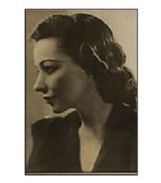

<!DOCTYPE html>
<html>
    <head>
        <meta charset="UTF-8">
        <title>Clementina Suarez</title>
        <link rel="stylesheet" type="text/css" href="ClementinaCSS.css">
        <link rel="stylesheet" type="text/css" href="normalize.css">
        <link rel="preconnect" href="https://fonts.gstatic.com">
        <link rel="icon" href="CLAMENTINA_S copy.ico">
    </head>
    <body>
        

            

                Clementina Suarez
                

                    

                            Informacion Personal
                    

                    
                    <table  class="tabla_datos-rapidos">
                        <tr>
                            <td>Nacimiento: 12/05/1092/Juticalpa<td>
                        </tr>
                        <tr>
                            <td>Fallecimiento: 07/12/1991/Tgu.</td>
                        </tr>
                        <tr>
                            <td>Nacionalidad: Hondureña</td>
                        </tr>
                        <tr>
                            <td>Ocupacion: Escritora y Poeta</td>
                        </tr>
                    </table>
                

                

                    <b class="primeros_años">Primeros Años</b>
                    

                        Nacio el 12 de Mayo de 1902 en Juticalpa y desde temprana edad abandono a su familia
                        que queria confiscarla para matrimonio tradicional.
                        Busco refugio en la capital del
                        pais pero siendo incomprendida por la sociedad se dedico a escribir sobre temas urgentes.
                        Su espiritu y caracter la llevo a ser y declararse feminista a temparana edad.
                    

                    

                        Su forma de ser chocó con los estandares de su tiempo. Y no solo lo hacia con su caracter,
                        tambien con su forma de vestir y hasta en sus obras(aunque la gente se interesaba mas en
                        su vida que a lo que se dedicaba)
                    

                    

                        <b class="Trayectoria">Trayectoria</b>
                        Ella fue participe de todos los acontecimientos importantes en los que pudo involucrarse.
                        Rechazo codigos como los de groserias e intolerancia. Sin nigun signo de prudencia, Clementina
                        llevo a cabo su vida siendo desbordantemente autentica. En lugares como El Jardin de Italia
                        fue la unica mujer en desenvolverse con los intelectuales de aquellos años.
                        Entre ellos
                        estan Antonio Rosa(Uno de sus esposos y con quein tuvo 2 hijas), Alfondo Guillén Zelaya(director del cronista)
                        entre otros que eran de su talla intelectual y que asumian su
                    

                    
    
                        feminidad. En sus obras deja muy claros todos estos penamientos e ideas que tenia sobre la cultura.
                        Muchas de estas tambien abordan la relacion entre poder, saber y sobre la sexualidad en la mujer
                        a pesar de las consecuencias.
                    

                    

                        Clementina viajo por el mundo justo como ella fué, con sus propias normas. Todo Centroamérica, Mexico y hasta Nueva York
                        fueron sus destinos para "conquistar la libertad". En ciudades de todos estos paises y estados recito su poesia y trabajo
                        siendo obrera que demostraba su vision del camino a una sociedad igualitaria.
                        Trsistemento fallecio el 9 de Diciembre despues de pasar 2 dias inconciente por haber recibido una serie de golpes por
                        criminales "comunes" el.
                    

                    

                        <b class="b_obras-destacadas">Obras Destacadas</b>
                        <ul class="lista_obras-destacadas">
                            <li>Corazon Sangrante</li>
                            <li>De mis Sabados el ultimo</li>
                            <li>Canto a la encontrada Patria y a su Héroe</li>
                            <li>El Poeta y sus Señales</li>
                            <li>Templos de Fuego</li>
                        </ul>
                    

                

            

        

        <footer class="footer">
            Fuentes: <a href="https://www.ecured.cu/Clementina_Suárez" target="_BLANK">Ecured.com</a>
        </footer>
    </body>
</html>
